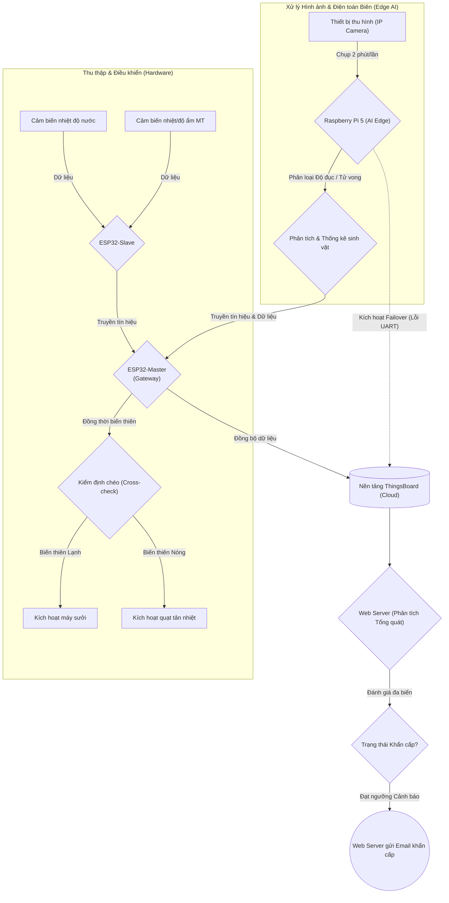
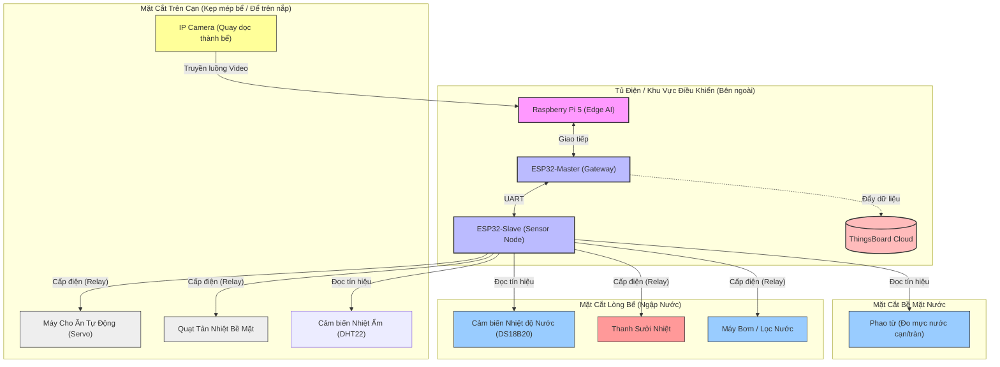

# HỆ THỐNG GIÁM SÁT VÀ ĐIỀU KHIỂN TỰ ĐỘNG BỂ CÁ ỨNG DỤNG IOT VÀ TRÍ TUỆ NHÂN TẠO

Dự án nghiên cứu và ứng dụng nền tảng Vạn vật kết nối (IoT) kết hợp với Trí tuệ nhân tạo (AI) nhằm xây dựng một hệ thống giám sát và điều khiển tự động toàn diện cho môi trường thủy sinh. Hệ thống được thiết kế để duy trì môi trường sống ổn định cho sinh vật, đồng thời tích hợp thị giác máy tính (Computer Vision) để phân tích hành vi và trạng thái sức khỏe của sinh vật theo thời gian thực.

---

## MỤC LỤC
1. [Mục tiêu nghiên cứu](#1-mục-tiêu-nghiên-cứu)
2. [Đặt vấn đề và Đối tượng nghiên cứu](#2-đặt-vấn-đề-và-đối-tượng-nghiên-cứu)
3. [Khảo sát hiện trạng và Điểm mới của đề tài](#3-khảo-sát-hiện-trạng-và-điểm-mới-của-đề-tài)
4. [Các tính năng cốt lõi](#4-các-tính-năng-cốt-lõi)
5. [Quy trình hoạt động và Kiến trúc hệ thống](#5-quy-trình-hoạt-động-và-kiến-trúc-hệ-thống)
6. [Cấu trúc phần cứng và phần mềm](#6-cấu-trúc-phần-cứng-và-phần-mềm)

---

## 1. MỤC TIÊU NGHIÊN CỨU
Mục tiêu cốt lõi của dự án là nghiên cứu, thiết kế và chế tạo một hệ thống sinh thái thủy sinh thông minh tự vận hành, có khả năng tự động điều tiết các yếu tố môi trường (nhiệt độ, mức nước, độ trong của nước) thông qua mạng lưới Vạn vật kết nối (IoT). Song song với việc duy trì chất lượng nước ở trạng thái lý tưởng, nghiên cứu này đặt tham vọng tích hợp hệ thống Trí tuệ Nhân tạo tại biên (Edge AI) để thực hiện giám sát trực tiếp "thực thể" sinh học. Cụ thể, hệ thống sẽ liên tục phân tích hình ảnh từ camera để trích xuất dữ liệu về tần suất bơi lội, tập tính ăn và trạng thái sức khỏe của sinh vật, qua đó phát hiện sớm các rủi ro (chẳng hạn như sinh vật mắc bệnh, lờ đờ, hay tử vong) mà các cảm biến hóa lý truyền thống không thể nhận diện được. Sự kết hợp giữa IoT và AI hướng tới việc thay thế hoàn toàn phương thức chăm sóc thủ công, giảm thiểu tối đa rủi ro hao hụt sinh vật và cung cấp một nền tảng quản trị từ xa toàn diện, độ trễ thấp thông qua Web Server và các ứng dụng di động.

## 2. ĐẶT VẤN ĐỀ VÀ ĐỐI TƯỢNG NGHIÊN CỨU

### 2.1. Đối tượng nghiên cứu và ứng dụng
Nghiên cứu tập trung giải quyết bài toán chăm sóc thủy sinh cho ba nhóm đối tượng chính:
\+ **Người nuôi cá cảnh gia đình:** Những cá nhân thiếu kiến thức chuyên sâu về hóa sinh môi trường nước, thường gặp khó khăn trong việc thiết lập chu trình vi sinh và duy trì nhiệt độ ổn định.  
\+ **Cơ sở kinh doanh và bảo tồn thủy sinh:** Các mô hình kinh doanh quy mô vừa và nhỏ cần tự động hóa việc theo dõi tình trạng của hàng loạt bể chứa nhằm tối ưu hóa chi phí nhân sự và hạn chế lây lan dịch bệnh.  
\+ **Cá nhân có lịch trình bận rộn:** Những người thường xuyên đi công tác, không có khả năng túc trực 24/7 để cho ăn định kỳ hoặc thay nước kịp thời khi có sự cố bộ lọc.  

### 2.2. Vấn đề thực tiễn
Theo các nghiên cứu về nuôi trồng thủy sản, sinh vật thủy sinh có độ nhạy cảm sinh học cực kỳ cao với sự dao động của môi trường. Các vấn đề cấp thiết hiện nay bao gồm:
\+ **Biến động thông số hóa lý (Physicochemical Fluctuations):** Sự biến thiên đột ngột về nhiệt độ (chênh lệch quá 2-3°C trong ngày) hoặc sự tích tụ của các hợp chất độc hại (Amoniac, Nitrat) do thức ăn thừa sẽ trực tiếp gây sốc phản vệ, làm suy giảm hệ miễn dịch của sinh vật.  
\+ **Rủi ro trong quá trình chăm sóc thủ công:** Việc cung cấp thức ăn dư thừa hoặc thiếu tính chu kỳ không chỉ gây ô nhiễm nguồn nước mà còn làm suy giảm tuổi thọ của vi sinh vật có lợi trong hệ thống lọc.  
\+ **Khoảng trống trong giám sát thời gian thực:** Đa số người dùng chỉ phát hiện sự cố (như rò rỉ nước, thiết bị sưởi chập cháy, cá chết lây lan) khi hậu quả đã trở nên nghiêm trọng do thiếu một hệ thống cảnh báo tức thời theo thời gian thực (Real-time alerting).  

### 2.3. Giải pháp đề xuất
Để giải quyết triệt để các vấn đề trên, đề tài đề xuất một giải pháp công nghệ đa tầng (Multi-layer Architecture) kết hợp giữa Cảm biến IoT (IoT Sensors) và Thị giác máy tính (Computer Vision). Hệ thống sẽ chủ động thu thập các biến số môi trường và hình ảnh thời gian thực, tiến hành phân tích đa biến trên bộ vi xử lý biên (Raspberry Pi 5) và đám mây (ThingsBoard). Khi hệ thống phát hiện các bất thường—chẳng hạn như nhiệt độ giảm sâu kết hợp với dấu hiệu cá bơi lờ đờ—nó sẽ lập tức kích hoạt chuỗi hành động cơ học (bật sưởi, kích hoạt sủi oxy) và tự động phát tín hiệu cảnh báo khẩn cấp tới quản trị viên mà không cần chờ sự can thiệp từ con người.

## 3. KHẢO SÁT HIỆN TRẠNG VÀ ĐIỂM MỚI CỦA ĐỀ TÀI

### 3.1. Hiện trạng các sản phẩm trên thị trường
Thị trường bể cá thông minh hiện tại (Smart Aquarium Market) đang có sự phát triển mạnh mẽ với các dòng sản phẩm tiêu biểu như Xiaomi Mijia (10L/20L MYG100, MYG200), DINGSMART Mini Wi-Fi Tank, hay Hygger Smart Aquarium Kit. Phân tích kiến trúc của các thiết bị này cho thấy chúng hầu hết đều chia sẻ một mô hình quản lý tập trung vào "môi trường nước", bao gồm:
\+ **Tự động hóa phần cứng cơ bản:** Tích hợp bơm nước, bộ lọc đa tầng và đèn LED RGB mô phỏng chu kỳ ánh sáng tự nhiên.  
\+ **Điều khiển từ xa (Remote Control):** Giao tiếp qua giao thức Wi-Fi/Bluetooth, cho phép người dùng bật/tắt thiết bị hoặc thiết lập lịch trình cho ăn thông qua ứng dụng di động độc quyền.  
\+ **Điều tiết cơ học (Actuation):** Có khả năng tự động cân bằng nhiệt độ qua hệ thống sưởi tích hợp.  
Tuy nhiên, theo các nghiên cứu về IoT trong nuôi trồng thủy sản, các hệ thống này mắc phải một **điểm mù công nghệ lớn**: Chúng hoàn toàn "mù" trước sinh vật sống trong bể. Việc kiểm soát nước tốt không đảm bảo sinh vật không bị bệnh, và hệ thống không thể tự nhận biết khi có cá chết để phát cảnh báo nhằm vớt ra trước khi nước bị nhiễm độc amoniac.

### 3.2. Điểm đóng góp và Tính đột phá
Tính đột phá (Novelty) của nghiên cứu này nằm ở việc vượt qua ranh giới của các hệ thống IoT truyền thống bằng cách tích hợp **Trí tuệ Nhân tạo dựa trên Thị giác máy tính (Computer Vision-based AI)**. Sự khác biệt cụ thể bao gồm:
\+ **Giám sát trực tiếp "Thực thể sống":** Chuyển dịch từ việc đo lường "môi trường" (IoT truyền thống) sang theo dõi trực tiếp "sinh vật". Hệ thống Camera liên tục thu thập luồng dữ liệu hình ảnh (Video stream) để phân tích hành vi sinh học.  
\+ **Mô hình AI dự báo rủi ro:** Triển khai các mạng nơ-ron học sâu (Deep Learning) trên phần cứng Raspberry Pi 5 để định vị quỹ đạo bơi, tốc độ di chuyển, và thống kê mật độ đàn. Từ đó, AI có thể phân loại và phát hiện các cá thể có biểu hiện bơi bất thường, mang mầm bệnh, hoặc lật ngửa bụng (tử vong).  
\+ **Quyết định ngữ cảnh đa biến (Context-aware Decision Making):** Khác với các hệ thống tự động thông thường (chỉ bật sưởi khi nước lạnh), hệ thống này kết hợp chéo dữ liệu từ AI Camera (nước chuyển màu đục) và cảm biến (mực nước thay đổi) để đưa ra phán đoán khẩn cấp (Critical Alarm), tự động gửi Email đính kèm ảnh chụp hiện trường để quản trị viên có phương án xử lý tức thời.  

## 4. CÁC TÍNH NĂNG CỐT LÕI
1. **Theo dõi thông số môi trường 24/7:** Đo đạc nhiệt độ, mực nước (có khả năng mở rộng tích hợp cảm biến pH, TDS).
2. **AI Camera phân tích hành vi và môi trường:** Đánh giá mức độ vẩn đục của nước, nhận diện tình trạng sinh vật (chết, mắc bệnh, bơi lờ đờ).
3. **Tự động hóa chuỗi hành động:**
   \- Kích hoạt quạt tản nhiệt hoặc máy sưởi dựa trên mức chênh lệch nhiệt độ.  
   \- Điều khiển bơm/thay nước khi mực nước suy giảm hoặc AI phân tích hình ảnh phát hiện nước bị đục.  
   \- Kích hoạt máy sủi oxy theo điều kiện thiết lập.  
   \- Cung cấp thức ăn theo định mức và lịch trình.  
4. **Nền tảng Quản trị (Hỗ trợ Offline):** Cho phép quản lý từ xa, xem video trực tiếp, và hiển thị trạng thái hoạt động thực của toàn bộ thiết bị (bơm, sưởi, quạt, đèn). Hệ thống hỗ trợ khả năng điều khiển thiết bị thủ công thông qua Mạng cục bộ (LAN), đảm bảo duy trì hoạt động ngay cả khi gián đoạn kết nối Internet.

## 5. QUY TRÌNH HOẠT ĐỘNG VÀ KIẾN TRÚC HỆ THỐNG

### 5.1. Thu thập và Xử lý dữ liệu (Kiến trúc Master - Slave)
\+ **ESP32-Slave (Cụm Cảm biến):** Chịu trách nhiệm trực tiếp thu thập dữ liệu từ cảm biến nhiệt độ nước, cảm biến nhiệt đới - độ ẩm không khí và truyền tín hiệu trạng thái về nút trung tâm.  
\+ **ESP32-Master (Nút Gateway Trung tâm):** Đóng vai trò là bộ vi điều khiển chính. Nút này tiếp nhận toàn bộ dữ liệu từ ESP32-Slave qua giao thức UART, đồng thời nhận tín hiệu và dữ liệu đếm số lượng sinh vật từ Raspberry Pi 5. Nút Gateway có nhiệm vụ tổng hợp và truyền tải dữ liệu lên nền tảng ThingsBoard.  
\+ **Thuật toán kích hoạt sưởi/quạt (Kiểm tra chéo - Cross-validation):** ESP32-Master chỉ phát lệnh chuyển đổi trạng thái của máy sưởi hoặc quạt tản nhiệt khi **đồng thời cả hai cảm biến** (nhiệt độ nước và nhiệt độ/độ ẩm môi trường) ghi nhận sự biến thiên tương quan. Thuật toán này ngăn chặn các lỗi kích hoạt giả (false positive) phát sinh do sự cố phần cứng của một cảm biến đơn lẻ.  
\+ **Cơ chế dự phòng (Failover) với Pi 5:** Trong tình huống phát sinh lỗi phần cứng làm gián đoạn liên kết UART giữa ESP32-Slave và ESP32-Master, Raspberry Pi 5 sẽ tự động đảm nhận vai trò dự phòng (Backup Gateway). Thiết bị này sẽ kích hoạt giao diện Wi-Fi để tiếp tục truyền tải toàn bộ dữ liệu lên nền tảng ThingsBoard, đảm bảo tính sẵn sàng cao (High Availability) cho hệ thống.  

### 5.2. Xử lý ảnh bằng Trí tuệ Nhân tạo (Computer Vision)
\+ Thiết bị thu hình (IP Camera/Smartphone) được bố trí tại vị trí quan sát bể, đảm nhiệm việc thu nhận và truyền luồng video về thiết bị điện toán biên **Raspberry Pi 5**.  
\+ **Vai trò chuyên biệt của Pi 5:** Pi 5 chuyên trách xử lý mô hình Trí tuệ Nhân tạo (AI) (tiến hành chụp ảnh chu kỳ 2 phút/lần để phân tích mức độ vẩn đục và trạng thái sinh vật). Kết quả phân tích sẽ được luân chuyển về **ESP32-Master**.  
\+ **Quy trình xác minh:** Khi mô hình phân loại phát hiện trạng thái bất thường (sinh vật lật ngửa), hệ thống tự động chuyển đổi sang cơ chế chụp và phân tích liên tục tần số cao nhằm xác thực tình trạng tử vong.  
\+ Sau quá trình xác thực, hệ thống tiến hành tính toán lại số lượng cá thể, truyền dữ liệu về ESP32-Master để đồng bộ hóa với cơ sở dữ liệu lưu trữ.  

### 5.3. Quản trị và Đánh giá cảnh báo (AI trên Web Server)
\+ **Giám sát và Điều khiển (Offline Support):** Web Server thu nhận và lưu trữ chính xác trạng thái logic (Bật/Tắt) của từng thiết bị trong hệ thống. Quản trị viên có đặc quyền can thiệp thủ công thông qua giao diện Web. Việc triển khai Web Server cho phép người dùng thao tác thông qua mạng nội bộ (LAN), đảm bảo tính toàn vẹn của việc điều khiển ngoại tuyến khi xảy ra sự cố mạng diện rộng.  
\+ **Mô hình AI Đánh giá Tổng quát:** Dữ liệu môi trường (từ ESP32) và dữ liệu thị giác máy tính (từ Raspberry Pi 5) được tổng hợp tại Web Server. Web Server triển khai một mô hình AI phân tích để đánh giá toàn diện, phân loại xem trạng thái hệ thống có đạt ngưỡng **"Cảnh báo Khẩn cấp" (Critical Alarm)** hay không.  
\+ Nếu thuật toán đánh giá phân loại trạng thái ở mức rủi ro cao (ví dụ: nhiệt độ vượt ngưỡng an toàn kết hợp với độ đục cao và sinh vật lờ đờ), hệ thống sẽ lập tức khởi tạo tiến trình gửi Email khẩn cấp đến quản trị viên.  

### 5.4. Sơ đồ khối quy trình (Workflow Diagram)

## 6. CẤU TRÚC PHẦN CỨNG VÀ PHẦN MỀM
\+ **Phần cứng viễn thông & Điều khiển (Hardware/IoT):** Hệ thống triển khai 02 module ESP32 (cấu trúc Master-Slave) / Arduino và 01 thiết bị Raspberry Pi 5 (đảm nhiệm Edge AI).  
\+ **Thiết bị Cảm biến & Cơ cấu chấp hành:** Cảm biến đo nhiệt độ dung dịch (DS18B20), Cảm biến siêu âm/Phao từ (HC-SR04), Cảm biến nhiệt đới - độ ẩm môi trường (DHT11/DHT22), Động cơ Servo (Cấp thức ăn).  
\+ **Hệ thống Thị giác máy tính (AI Camera):** IP Camera / ESP32-CAM / Webcam tích hợp kết nối cùng Raspberry Pi.  
\+ **Kiến trúc Dữ liệu và Đám mây (Backend & Cloud):** Nền tảng ThingsBoard (đóng vai trò lưu trữ cơ sở dữ liệu và MQTT Broker) kết hợp cùng Web Server (phát triển trên nền tảng Node.js/Python có tích hợp mô hình AI) để phục vụ tác vụ phân tích và gửi thông báo.  
\+ **Giao diện Người dùng (Frontend):** Bảng điều khiển (Dashboard) của nền tảng ThingsBoard, hỗ trợ mở rộng bằng Ứng dụng di động tùy chỉnh (React Native / Flutter).  

### 6.1. Sơ đồ Hình khối Phân lớp Vật lý (Cross-sectional Hardware Diagram)
Sơ đồ dưới đây mô phỏng cấu trúc vật lý và các không gian (mặt cắt) của bể cá, chia rõ các thiết bị theo vị trí lắp đặt thực tế nhằm đảm bảo tính an toàn điện và tối ưu hiệu suất:

### 6.2. Phân tích chi tiết các lớp không gian vật lý

1. **Lớp Tủ điện / Khu vực điều khiển (Bên ngoài bể):**
   \- Không gian này được thiết kế hoàn toàn cách ly với môi trường nước nhằm đảm bảo an toàn điện tĩnh và ngăn chặn sự cố chập cháy.  
   \- Đây là nơi chứa bộ não của hệ thống bao gồm: Raspberry Pi 5 (xử lý mô hình học sâu) và 02 vi điều khiển ESP32 (Master/Slave).  
   \- Sự cách ly vật lý này giúp tối ưu hóa khả năng tản nhiệt cho các vi xử lý (đặc biệt là Pi 5 khi chạy các tác vụ AI liên tục), đồng thời bảo vệ tín hiệu viễn thông (Wi-Fi/Bluetooth) không bị nhiễu do môi trường nước.  

2. **Lớp Mặt cắt Trên cạn (Gắn tại mép bể hoặc nắp bể):**
   \- Không gian này bao gồm các thiết bị yêu cầu hoạt động trong môi trường thoáng khí nhưng phải tương tác trực tiếp với bề mặt bể.  
   \- **Thiết bị tiêu biểu:** IP Camera (được cố định ở góc nhìn bao quát toàn bộ lòng bể phục vụ phân tích thị giác máy tính), Máy cho ăn tự động bằng động cơ Servo (bố trí phía trên để thức ăn rơi tự do), Quạt tản nhiệt bề mặt, và Cảm biến nhiệt đới - độ ẩm (DHT22) để đo lường vi khí hậu xung quanh bể.  

3. **Lớp Mặt cắt Ngập nước (Bề mặt và Lòng bể):**
   \- Không gian này chứa các linh kiện, cảm biến và thiết bị cơ điện đạt tiêu chuẩn chống nước cao (IP67/IP68), được thiết kế để ngâm trực tiếp hoặc tiếp xúc liên tục với môi trường dung dịch thủy sinh.  
   \- **Thiết bị tiêu biểu:** Đầu dò cảm biến nhiệt độ (DS18B20) đo chính xác nhiệt dung, Cảm biến mực nước (Phao từ) dùng để phát tín hiệu cảnh báo tràn hoặc cạn, Thanh sưởi nhiệt, và hệ thống Máy bơm/Lọc nước (duy trì luân chuyển dòng chảy sinh thái).  
